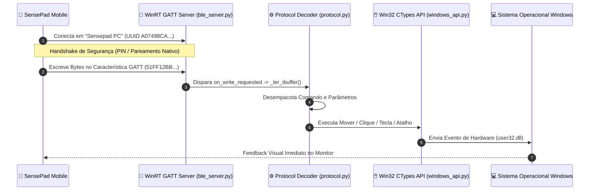

<div align="center">

# 💻 SensePad Desktop Server — Mini Documentação & Tutorial

**O Servidor GATT BLE e Controlador WinRT de Ultra-Baixa Latência para Windows**

[](https://www.python.org/)
[](https://learn.microsoft.com/en-us/windows/uwp/api/)
[](https://docs.python.org/3/library/asyncio.html)
[](https://github.com/hbldh/bleak)
[](https://pyinstaller.org/)

---

</div>

## 📑 Índice

1. [Visão Geral e Arquitetura do Servidor](#1-visão-geral-e-arquitetura-do-servidor)
2. [Mini Documentação Técnica dos Módulos](#2-mini-documentação-técnica-dos-módulos)
   - [Módulo GATT Server (`ble_server.py`)](#módulo-gatt-server-ble_serverpy)
   - [Roteador de Protocolo (`protocol.py`)](#roteador-de-protocolo-protocolpy)
   - [Simulador Win32 via CTypes (`windows_api.py`)](#simulador-win32-via-ctypes-windows_apipy)
3. [Tutorial Completo: Como Iniciar o Servidor](#3-tutorial-completo-como-iniciar-o-servidor)
   - [Fase 1: Pré-requisitos do Computador](#fase-1-pré-requisitos-do-computador)
   - [Fase 2: Configuração e Ambiente Virtual (venv)](#fase-2-configuração-e-ambiente-virtual-venv)
   - [Fase 3: A Importância do Modo Administrador](#fase-3-a-importância-do-modo-administrador)
   - [Fase 4: Inicialização e Conexão](#fase-4-inicialização-e-conexão)
4. [Tutorial de Compilação: Gerando o Executável Standalone (`.exe`)](#4-tutorial-de-compilação-gerando-o-executável-standalone-exe)
5. [Tabela de Mapeamento de Atalhos do Sistema](#5-tabela-de-mapeamento-de-atalhos-do-sistema)
6. [Estrutura Detalhada de Arquivos e Pastas](#6-estrutura-detalhada-de-arquivos-e-pastas)
7. [Guia de Diagnóstico e Resolução de Problemas (Troubleshooting)](#7-guia-de-diagnóstico-e-resolução-de-problemas-troubleshooting)

---

## 1. Visão Geral e Arquitetura do Servidor

O **SensePad Desktop Server** é o coração da experiência de controle remoto no PC. Ele é executado em segundo plano no computador Windows, atuando como um **Servidor GATT (Generic Attribute Profile)** via Bluetooth Low Energy.

Sua arquitetura foi projetada com zero dependências de interfaces gráficas pesadas, priorizando a estabilidade do event-loop do `asyncio` e chamadas de sistema diretas.



---

## 2. Mini Documentação Técnica dos Módulos

### Módulo GATT Server (`ble_server.py`)
Responsável por interagir diretamente com as APIs modernas do Windows Runtime (`winrt.windows.devices.bluetooth.genericattributeprofile`).
* **Criação do Provedor GATT:** Instancia um `GattServiceProvider` utilizando o UUID principal do serviço definido no arquivo `config.py`.
* **Políticas de Acesso e Segurança:**
  * Define as propriedades como leitura, escrita com resposta e **escrita sem resposta** (*Write Without Response*), vital para sustentar os 60 FPS de movimentação do mouse.
  * Força o nível de proteção para `GattProtectionLevel.ENCRYPTION_AND_AUTHENTICATION_REQUIRED`. Isso garante que apenas dispositivos emparelhados e autorizados no nível do sistema operacional Windows possam enviar comandos ao computador, blindando o PC contra conexões anônimas.
* **Conversão de Buffer WinRT (`_ler_ibuffer`):** Como os dados chegam da API nativa do Windows no formato COM/WinRT `IBuffer`, o módulo implementa um leitor que extrai os dados em bruto de forma otimizada, alocando um `bytearray` com o tamanho exato da mensagem e convertendo para um objeto `bytes` do Python em microsegundos.

### Roteador de Protocolo (`protocol.py`)
Atua como o maestro do servidor, recebendo os pacotes brutos do callback BLE e acionando as chamadas de hardware corretas.
* **Decodificação Binária:** Utiliza o módulo nativo `struct` para desempacotar inteiros assinados (`int8` via `'bb'`), traduzindo bytes puros em deslocamentos cartesianos de mouse (`dx`, `dy`) ou vetores de rolagem (`scroll`).
* **Mapeamento Dicionarial de Macros:** Mantém um mapa estático (`SHORTCUT_MAP`) que associa IDs numéricos simples (recebidos em 1 único byte do celular) a sequências complexas de teclas (ex: `('win', 'shift', 's')`).
* **Isolamento de Falhas:** O método `processar_payload` é envolto em blocos de captura de exceção locais, garantindo que se o celular enviar um pacote corrompido ou fora de formato, o erro seja apenas registrado no log sem jamais travar ou derrubar o servidor BLE.

### Simulador Win32 via CTypes (`windows_api.py`)
Para que o computador reconheça os comandos remotamente como se um mouse ou teclado USB físico tivessem sido conectados, este módulo acessa a biblioteca nativa `user32.dll` do Windows por meio do módulo `ctypes` do Python.
* **Desempenho de Bare-Metal:** Elimina a latência introduzida por bibliotecas Python de automação de alto nível (como `pyautogui` ou `pynput`), enviando estruturas `INPUT` nativas diretamente à fila de mensagens de hardware do Windows.
* **Compatibilidade Universal:** Funciona em qualquer cenário do Windows, incluindo a Área de Trabalho, navegadores, jogos em DirectX/Vulkan rodando em tela cheia e telas com múltiplos monitores.

---

## 3. Tutorial Completo: Como Iniciar o Servidor

Siga este passo a passo para configurar, instalar e executar o servidor BLE no seu computador.

### Fase 1: Pré-requisitos do Computador
Antes de começar, verifique se o seu computador atende aos seguintes requisitos:
1. **Sistema Operacional:** Windows 10 (Atualização 1809 ou superior) ou **Windows 11**.
2. **Bluetooth:** Adaptador Bluetooth 4.0 (ou superior) com suporte a Bluetooth Low Energy (BLE).
   * *Dica:* Se seu computador não tiver Bluetooth interno, dongles USB BLE padrão 4.0/5.0 são 100% compatíveis.
3. **Python 3.10 ou superior:** Baixe em [python.org](https://www.python.org/downloads/windows/). 
   * ⚠️ **MUITO IMPORTANTE:** Durante a instalação do Python, marque obrigatoriamente a caixinha **"Add Python to PATH" (Adicionar Python ao PATH)** no instalador.

### Fase 2: Configuração e Ambiente Virtual (venv)
A prática mais segura no Python é isolar as dependências do projeto em um ambiente virtual.
1. Abra um terminal (PowerShell ou Prompt de Comando) e navegue até a pasta onde deseja salvar o projeto:
   ```powershell
   git clone https://github.com/seu-usuario/sensepad-desktop.git
   cd SensePad-Desktop/SensePad-Desktop
   ```
2. Crie um ambiente virtual chamado `venv`:
   ```powershell
   python -m venv venv
   ```
3. Ative o ambiente virtual:
   * **No PowerShell:**
     ```powershell
     .\venv\Scripts\Activate.ps1
     ```
     *(Se receber um erro de política de execução, execute `Set-ExecutionPolicy -Scope Process -ExecutionPolicy Bypass` e tente novamente).*
   * **No CMD (Prompt de Comando):**
     ```cmd
     .\venv\Scripts\activate.bat
     ```
4. Com o `(venv)` aparecendo no início da linha do terminal, instale as bibliotecas necessárias:
   ```powershell
   pip install -r requirements.txt
   ```

### Fase 3: A Importância do Modo Administrador
Para que o SensePad funcione perfeitamente, **o terminal onde você roda o servidor deve ser executado com privilégios de Administrador**.
* **Por que isso é fundamental?** O recurso de segurança *UAC (User Account Control)* do Windows impede que processos comuns (sem elevação) enviem cliques de mouse ou teclas para janelas que estejam rodando como Administrador (por exemplo: Gerenciador de Tarefas, Editor do Registro, instaladores de programas e a maioria dos jogos modernos em tela cheia).
* **Como fazer:** Feche o terminal atual, clique no menu Iniciar, digite `PowerShell` ou `Terminal`, clique com o botão direito sobre o ícone e selecione **"Executar como Administrador"**. Em seguida, navegue até a pasta do projeto e reative o seu `venv`.

### Fase 4: Inicialização e Conexão
1. Com o terminal rodando como Administrador e o ambiente virtual ativo, inicie o servidor rodando:
   ```powershell
   python main.py
   ```
2. O console exibirá as seguintes mensagens de confirmação:
   ```text
   ============================================================
   Iniciando Sensepad Desktop Server...
   AVISO: Certifique-se de executar este terminal como ADMINISTRADOR
   para que os comandos de mouse (ctypes) funcionem corretamente.
   ============================================================
   2026-07-03 ... - INFO - Criando serviço GATT...
   ```
3. Pegue seu smartphone, abra o app **SensePad Client** e toque para conectar.
4. O Windows exibirá uma notificação sonora e visual de **Pedido de Emparelhamento Bluetooth**. Clique na notificação e confirme o pareamento no PC e no celular.
5. O terminal do servidor mostrará logs de conexão e os movimentos de mouse começaram a ser processados em tempo real!

---

## 4. Tutorial de Compilação: Gerando o Executável Standalone (`.exe`)

Se você deseja distribuir o SensePad para amigos ou usá-lo sem ter que abrir o terminal Python toda vez, você pode compilar o servidor em um único arquivo executável autossuficiente `.exe`.

1. Certifique-se de que a ferramenta **PyInstaller** está instalada no seu ambiente virtual:
   ```powershell
   pip install pyinstaller
   ```
2. O projeto já vem com dois arquivos de especificação (`.spec`) pré-configurados com todos os metadados e bibliotecas WinRT embutidos:
   * **`SensePad-Server.spec` (Modo Produção):** Compila o servidor sem janela de terminal (processo em segundo plano silencioso).
   * **`SensePad-Server-Debug.spec` (Modo Depuração):** Compila mantendo a janela de console aberta, ideal para inspecionar logs de erro.
3. Para gerar a versão final, execute o comando:
   ```powershell
   pyinstaller SensePad-Server.spec
   ```
4. O PyInstaller analisará o código e empacotará o Python, bibliotecas WinRT e DLLs necessárias. O processo demora cerca de 1 a 2 minutos.
5. Quando concluído, acesse a pasta gerada chamada `dist/`. Dentro dela estará o seu arquivo **`SensePad-Server.exe`**.
6. **Para usar:** Basta clicar com o botão direito no `SensePad-Server.exe` e selecionar **Executar como Administrador**!

---

## 5. Tabela de Mapeamento de Atalhos do Sistema

Quando o aplicativo móvel envia o comando `CMD_ATALHO` (`0x06`), o arquivo `protocol.py` consulta o dicionário `SHORTCUT_MAP` para disparar as teclas do sistema:

| ID do Atalho | Ação UI no Celular | Teclas Pressionadas Simultaneamente no Windows | Função Prática |
| :---: | :--- | :--- | :--- |
| `1` | Copiar | `Ctrl + C` | Copia texto, arquivos ou itens selecionados |
| `2` | Colar | `Ctrl + V` | Cola o conteúdo atual da área de transferência |
| `3` | Recortar | `Ctrl + X` | Recorta o item selecionado |
| `4` | Desfazer | `Ctrl + Z` | Desfaz a última ação no Windows |
| `5` | Selecionar Tudo | `Ctrl + A` | Seleciona todo o conteúdo da tela ou documento |
| `6` | Salvar | `Ctrl + S` | Salva o documento ou projeto aberto no momento |
| `7` | Localizar | `Ctrl + F` | Abre a barra de pesquisa/busca |
| `8` | Captura de Tela | `Win + Shift + S` | Abre a ferramenta oficial de recorte do Windows (Snipping Tool) |

> 💡 *Você pode adicionar seus próprios atalhos customizados simplesmente adicionando novas linhas ao dicionário `SHORTCUT_MAP` no arquivo `core/protocol.py` e recompilando ou reiniciando o servidor.*

---

## 6. Estrutura Detalhada de Arquivos e Pastas

```text
SensePad-Desktop/
├── core/
│   ├── __init__.py        # Marca o diretório como um pacote Python importável
│   ├── ble_server.py      # Gestão assíncrona do serviço GATT, autenticação WinRT e callback de leitura
│   ├── protocol.py        # Desempacotador struct, roteamento de comandos CMD e tabela SHORTCUT_MAP
│   └── windows_api.py     # Wrappers de baixo nível ctypes para manipulação do mouse e teclado (user32.dll)
├── config.py              # Definição estática do SERVER_NAME ("Sensepad PC") e UUIDs GATT
├── main.py                # Entry point: configura log, valida permissões e inicia o event loop asyncio
├── requirements.txt       # Lista de pacotes e dependências nativas (bleak, winrt-runtime, etc.)
├── SensePad-Server.spec   # Configuração PyInstaller para compilação em executável de produção (.exe)
├── SensePad-Server-Debug.spec # Configuração PyInstaller com console ativo para depuração de problemas
└── README.md              # Documentação oficial do servidor Windows
```

---

## 7. Guia de Diagnóstico e Resolução de Problemas (Troubleshooting)

| Problema / Sintoma | Causa Mais Provável | Como Resolver |
| :--- | :--- | :--- |
| **`Falha ao criar serviço GATT. Código de erro: -2147024891`** | O Bluetooth do computador está desligado ou sem driver instalado. | Verifique se o ícone do Bluetooth está ativo na barra de tarefas. Vá em *Configurações > Bluetooth e dispositivos* e ative a chave. Se usar dongle USB, tente trocá-lo de porta. |
| **O aplicativo no celular não encontra o `"Sensepad PC"`** | O computador não está no modo detectável ou outro app está travando o rádio Bluetooth. | Certifique-se de que o servidor exibiu a mensagem de que iniciou com sucesso. Verifique nas opções de Bluetooth do Windows se o computador está configurado como *Descoberta de Bluetooth: Avançada*. |
| **O mouse move na Área de Trabalho, mas congela quando abro um Jogo ou o Gerenciador de Tarefas** | O servidor Python/EXE foi executado sem privilégios administrativos. | Feche imediatamente o terminal (ou processo do exe). Clique com o botão direito no ícone do PowerShell ou do seu `.exe` e selecione **"Executar como Administrador"**. |
| **Aparece o erro `ExecutionPolicy` ao tentar ativar o `venv`** | A política de segurança do PowerShell bloqueia scripts locais. | No PowerShell, digite o comando: `Set-ExecutionPolicy -Scope Process -ExecutionPolicy Bypass` e pressione Enter. Depois ative o venv normalmente. |
| **O celular conecta e desconecta logo em seguida** | Falha na negociação da chave de criptografia de pareamento do Windows. | No computador, abra as *Configurações de Bluetooth*, localize o seu celular na lista de dispositivos pareados e clique em **Remover dispositivo**. No celular, vá em Bluetooth e esqueça o PC. Conecte novamente através do app SensePad e aceite o novo pareamento. |
| **O terminal congela e não responde a novos comandos** | O Modo de Seleção Rápida do CMD/PowerShell foi ativado por um clique acidental do mouse no terminal. | Pressione a tecla **ESC** ou **Enter** dentro da janela do terminal para liberar o buffer de texto do Windows. |

---

<div align="center">
  💻 Documentação gerada e mantida pela equipe SensePad Desktop.
</div>
